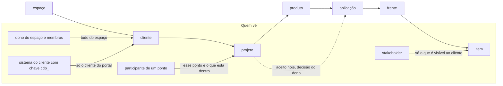

# Ordem de serviço do banco nº1: relatório final (03/10/2026)

Projeto Supabase `tfcvoszeewmpghgxztuy`. Tudo foi por migração versionada (registrada em `supabase_migrations.schema_migrations`), cada uma com plano de volta (`*_VOLTA.sql`) e teste. Nada foi apagado.

| Migração | Hora (UTC) | Itens |
|---|---|---|
| `57_segredos_no_vault` | 17:26 | S1 |
| `58_funcoes_fora_da_api` | 17:38 | S2 |
| `59_historico_so_insercao_e_execucao` | 17:39 | S3, S6, S7 |
| `60_onda2_arvore_e_permissoes` | 17:46 | O2, O3, S8, S10 |
| `61_webhook_repeticao_e_limite` | 17:49 | S9 |
| `62_onda3_indices_rotinas_politicas_comentarios` | 17:53 | I1, I3, I4, O5 |

Função publicada: `portal-api` versão 4 (verify_jwt continua false), para responder 429 no limite de chamadas.

Suíte de testes num comando: `PGHOST=... PGPORT=... PGUSER=... sh banco/testar.sh` (monta o banco limpo e roda os 21 arquivos de teste, cada um numa cópia limpa; última rodada: 616 OK, 3 FALHA que já existiam antes desta ordem e não são destes itens: `98_teste_comunicacao`, `99_teste_infra_auto`, `99_teste_po`; mais um ERRO antigo em `94_teste_admin`).

## Tabela final

| Item | Situação | O que foi feito | Prova |
|---|---|---|---|
| S1 Segredos | **certo** (troca dos segredos: precisa de confirmação) | 7 segredos em texto puro (app do Supabase, 2 apps do Git, chaves do Supabase, 2 endereços de banco) foram para o Vault; coluna antiga fica sempre vazia (regra `segredo_fora_do_vault`); gatilho guarda qualquer valor novo no Vault; apagar a linha apaga do Vault | `99_teste_segredos` (16 OK); em produção: 0 valores nas colunas antigas, funções devolvem os segredos certos, e às 17:30 o robô leu os dois bancos ligados por endereço já pelo Vault. Funções que devolvem segredo: só `service_role` |
| S2 Funções security definer | **certo** (`search_path` vazio: em parte) | As 51 foram para o esquema `logica` (não exposto); no `public` ficou a porta fina (security invoker) com o mesmo nome e parâmetros; tabela abaixo | `99_teste_rpc_fora` (57 OK: pessoa de outro espaço recebe 42501 ou nada nas 51); aviso 0029 zerado; em produção, o dono logado usa normalmente (lixeira, admin, IA). `search_path` ficou fixo `public, pg_temp` (não vazio): trocar exigiria reescrever o corpo das 51 com nome completo de tudo, com risco de quebrar telas |
| S3 Auditoria e histórico | **certo** | Gatilho recusa UPDATE, DELETE e TRUNCATE nas 3 tabelas, para todos (até o dono do banco); permissões de mudar retiradas. Exceções automáticas: apagar o item de vez leva o histórico; apagar pessoa só esvazia a autoria; versão da descrição aberta por 10 min para a mesma pessoa (regra antiga da parte 18) | `99_teste_historico` (37 OK); em produção, UPDATE e DELETE recusados com 42501. Corrente de hash (opcional): não feita |
| S4 `copia_exemplo` | **falta: precisa de confirmação** | Origem: criado direto no banco (não está em nenhuma migração nem no repositório), cópia dos dados de exemplo (38 tabelas, 279 linhas; 19 dos 53 nós ainda existem no public). Não é exposto pela API e ninguém de fora tem acesso. Script pronto: guarda tudo em `interno.arquivo_esquemas`, confere e apaga | `PRECISA_CONFIRMACAO_apagar_copia_exemplo.sql`, testado numa cópia local |
| S5 Senhas vazadas | **falta: depende do plano** | O Supabase recusou ligar: "disponível no plano Pro ou maior" (o projeto está no plano grátis). MFA por aplicativo (TOTP) já está ligado | Resposta 402 da API de configuração |
| S6 Função com nome de pessoa | **certo** | `interno.espaco_do_william()` apagada; o arquivo 15 usa um auxiliar temporário sem nome de pessoa (só servia para as mudanças de uma vez) | `99_teste_historico`: nenhuma função ou política com nome de pessoa; em produção: 0 |
| S7 `search_path` e anon | **certo** | `search_path` fixo em `interno.infra_aba_ok`; anon e "todo mundo" perderam execute em 21 funções do `interno` (quem está logado manteve); função nova no `interno`, `public` e `logica` não dá execute a todo mundo sozinha | Consulta do anexo: 0 linhas (public, interno e logica) |
| S8 `bi.ritmo_semanal` | **certo (com justificativa)** | É vista **materializada**: o Postgres não tem `security_invoker` para ela. As 14 vistas normais do `bi` já têm. Ninguém logado lê a materializada (permissão retirada e documentada no comentário) | `99_teste_arvore` (S8) |
| S9 Funções sem login | **em parte** | git-webhook: o mesmo aviso (já conferido pela assinatura) não é processado duas vezes (resumo guardado 30 dias). Janela de ±5 min: o GitHub e o GitLab não assinam a hora, então não dá para conferir com segurança. portal-api: 120 chamadas por minuto por chave, depois 429. `X-Portal-Usuario`: regra registrada abaixo, sem mudança | `99_teste_webhook` (8 OK), `portal-api/logica.test.ts` (429); em produção, o push deste relatório (17:59) chegou do GitHub sem erro, com a assinatura conferida pelo segredo do Vault, e os 2 avisos ficaram guardados contra repetição |
| S10 Permissões | **em parte** | Saíram as 23 permissões que nenhuma política deixava usar (em 12 tabelas; não muda nada para quem usa); vista `etiquetas_sistema` só leitura; tabela nova não ganha permissão sozinha; RLS ligada em todas as tabelas do `interno` (11 estavam sem) e na auditoria; exceção `cambio` documentada. FORCE RLS não ligado (as funções security definer são donas das tabelas e parariam). Não revisei tabela por tabela se cada escrita que tem política é usada pela tela | Tabela abaixo; `99_teste_isolamento` e `93_teste_multiusuario` iguais antes e depois |
| O1 Ordem da árvore | **certo (correção dos 3: precisa de confirmação)** | A regra já existia no banco (`interno.validar_pai` + `nos_raiz_so_cliente`), vale ao criar e ao mover. Ela aceita aplicação direto no projeto **de propósito** (parte 01). Por isso aparecem 3 casos: "YOU TURBO" (projeto BL), "Sistema Web" (projeto CicloDev), "aoo" (projeto teste), todos sem itens vivos. Script da árvore estrita pronto | `99_teste_arvore`: 14 combinações erradas recusadas; `PRECISA_CONFIRMACAO_arvore_estrita.sql` |
| O2 Exclusão em cascata | **certo** | Regra única: nó na lixeira leva os itens de dentro com a mesma hora; restaurar traz de volta os mesmos; a lixeira mostra só o nó. Os 128 itens vivos dentro de "MK - Plataformas" (excluída em 30/09) foram junto (lista guardada em `interno.o2_itens_levados`) | Consulta do anexo: 0 em produção; `99_teste_arvore` (excluir, restaurar, o que já estava na lixeira continua lá) |
| O3 Projeto do item | **certo** | Vista `itens_com_caminho` (security_invoker): item com cliente, projeto, produto e aplicação calculados na hora pela árvore | `99_teste_arvore`: mover a frente muda a aplicação na hora. "Nenhum relatório sem filtro de projeto": não revisei os relatórios um a um |
| O4 Esquema de API | **em parte** | Corpo das funções da API fora do esquema exposto (`logica`, S2). Lista tabela/módulo abaixo. Tirar as tabelas do esquema exposto **não foi feito**: a tela lê e grava direto nas tabelas (`sb.from(...)`) em muitos lugares; exigiria reescrever a tela | Tabela abaixo |
| O5 Comentários, documentação, testes | **certo (LGPD: levar ao dono)** | Comentário nas 64 tabelas que não tinham; desenho da árvore e do acesso abaixo; suíte em um comando (`banco/testar.sh`) | 0 tabelas sem comentário em produção |
| I1 Chaves sem índice | **certo** | Índice em todas as chaves estrangeiras sem índice (public, interno, auditoria). Sem `concurrently`: tabelas pequenas, índice em milissegundos, e `concurrently` não roda dentro da migração | Aviso `unindexed_foreign_keys` zerado; 0 em produção |
| I2 Índices sem uso | **certo (adiado como pedido)** | Nada apagado. Reavaliar em 02/11/2026 (30 dias). Hoje o aviso mostra 179 (inclui os índices novos do I1) | Relatório de desempenho do Supabase |
| I3 Rotinas | **em parte (prazo de limpeza: precisa de confirmação)** | As de 10 em 10 e de 5 em 5 minutos não caem mais no mesmo minuto (2, 4 e 6); nova rotina de hora em hora avisa o dono quando uma rotina falha 3 vezes seguidas. Relatório de falhas: 0 falhas em 15.049 execuções desde 26/09. Histórico: 2,5 MB | `PRECISA_CONFIRMACAO_limpar_historico_agendador.sql` |
| I4 Várias políticas | **certo** | Uma política por ação nas 13 tabelas, regra igual à soma das antigas | Em produção: assinatura de quem vê o quê igual antes e depois (`4646d14a…`, 26 combinações, 3.741 linhas); local: o que cada pessoa vê e muda igual; aviso zerado |
| I5 Backup e Storage | **falta: decisão do dono** | Plano grátis; a API de backups não lista nenhum backup e o PITR está desligado. Ensaio de restauração: não feito (pede projeto novo ou plano pago). Buckets `anexos` e `inventario` privados, com limite de tamanho; políticas do Storage lidas: leitura de anexo só se a pessoa enxerga o registro do anexo; inventário pela regra `inv_pasta_ok` | API `/database/backups`: `pitr_enabled: false`, `backups: []` |

## O que muda para quem usa (telas)

- **Lixeira, painéis, listas e progresso**: os 128 itens de "MK - Plataformas" (aplicação excluída em 30/09) deixam de contar como vivos; se a aplicação for restaurada, eles voltam junto.
- **Histórico da descrição**: igual (mexer seguido em até 10 minutos continua numa versão só).
- **Portal (sistema de fora)**: mais de 120 chamadas por minuto com a mesma chave recebem 429.
- **Avisos do GitHub/GitLab**: reenviar o mesmo aviso não faz nada (responde "repetido").
- Nenhuma outra tela muda: as funções da API mantêm nome, parâmetros e resposta.

## Esperando a ordem do dono (preparado, não executado)

1. **S1**: trocar os segredos que ficaram em texto legível até hoje (secret do app do Supabase, segredos dos 2 apps do Git, chaves do Supabase e as 2 senhas de banco). Exige recadastrar as conexões.
2. **S4**: apagar `copia_exemplo` (`PRECISA_CONFIRMACAO_apagar_copia_exemplo.sql`).
3. **S5**: plano Pro para ligar a proteção de senhas vazadas.
4. **O1**: o que fazer com as 3 aplicações direto num projeto, e se a árvore fica estrita (`PRECISA_CONFIRMACAO_arvore_estrita.sql`).
5. **I3**: prazo de guarda do histórico das rotinas (`PRECISA_CONFIRMACAO_limpar_historico_agendador.sql`, hoje com 14 dias).
6. **I5**: plano, PITR, backup diário, ensaio de restauração e cópia própria do Storage.
7. **S9**: regra de `X-Portal-Usuario` (abaixo).
8. **LGPD** (abaixo).
9. Senha errada do banco ligado da IT (`leitura_ciclodev`): o robô continua recebendo "password authentication failed".

## S9: por que estas funções não usam JWT, e a regra do X-Portal-Usuario

| Função | Por que sem JWT | Como confere quem chama |
|---|---|---|
| `git-webhook` | Quem chama é o GitHub ou o GitLab, sem login | Assinatura HMAC do app (GitHub) ou segredo do aviso (GitLab), conferidos no banco; corpo até 5 MB; o mesmo aviso não é processado duas vezes |
| `enviar-avisos` | Quem chama é a rotina do banco (pg_cron) | Segredo do Vault comparado em tempo constante |
| `diagramas-auto` | Quem chama é a rotina do banco | Segredo do Vault |
| `portal-api` | Quem chama é o sistema do cliente (Java da B&L) | Chave `cdp_...` (só o resumo sha256 fica no banco), 120 chamadas por minuto |

**X-Portal-Usuario**: hoje a chave é do sistema do cliente, que responde pelos usuários dele. O banco só aceita e-mail que é membro ativo **daquele** portal, e o nome de quem respondeu fica gravado no comentário do item. Quem tem a chave pode responder em nome de qualquer membro daquele portal (de outro portal, não). Opções para o dono: manter assim (o sistema do cliente é confiável); ou uma chave por pessoa; ou exigir um token assinado pelo sistema do cliente para cada usuário.

## LGPD: dado pessoal guardado (para o dono decidir por quê e por quanto tempo)

| Tabela | Colunas |
|---|---|
| `clientes` | documento, e-mail, telefone, endereço (cep, logradouro, número, complemento, bairro, cidade), contato (nome, cargo, e-mail, telefone), nome fantasia |
| `pessoas_privado` | nome completo, CPF, data de nascimento, endereço completo, cargo |
| `inv_funcionarios` | nome, CPF, telefone, cargo |
| `pessoas` | nome, e-mail |
| `portais_membros` | nome, e-mail |
| `convites` | e-mail |
| `pessoas_custos` | salário, pró-labore, valor PJ, benefícios (dado sensível de remuneração) |

## Desenho: a árvore e quem vê o quê

Regras: tudo passa pela RLS (`nos_visiveis` para ver, `nos_editaveis` para mudar); o que roda com o poder do dono fica em `logica` e confere a regra antes; segredos só no Vault, lidos só pelas funções do servidor.

## S2: as 51 funções (quem chama, checagem, teste)

| Função | Quem chama | Checagem | Teste negativo |
|---|---|---|---|
| `admin_banco` | tela Admin (admin.js) | só o dono do sistema (interno.exigir_dono) | sim: 99_teste_rpc_fora |
| `admin_historico` | tela Admin (admin.js) | só o dono do sistema (interno.exigir_dono) | sim: 99_teste_rpc_fora |
| `admin_ia_definir` | tela IA (ia.js) | só o dono do sistema (interno.exigir_dono) | sim: 99_teste_rpc_fora |
| `admin_ia_permissoes` | tela IA (ia.js) | só o dono do sistema (interno.exigir_dono) | sim: 99_teste_rpc_fora |
| `admin_resumo` | tela Admin (admin.js) | só o dono do sistema (interno.exigir_dono) | sim: 99_teste_rpc_fora |
| `admin_telas` | tela Admin (admin.js) | só o dono do sistema (interno.exigir_dono) | sim: 99_teste_rpc_fora |
| `admin_uso_diario` | tela Admin (admin.js) | só o dono do sistema (interno.exigir_dono) | sim: 99_teste_rpc_fora |
| `admin_usuarios` | tela Admin (admin.js) | só o dono do sistema (interno.exigir_dono) | sim: 99_teste_rpc_fora |
| `analise_inventario_ligar` | tela Segurança (seguranca.js) | ponto editável pela pessoa (interno.nos_editaveis) | sim: 99_teste_rpc_fora |
| `analise_marcar` | tela Segurança (seguranca.js) | ponto editável pela pessoa (interno.nos_editaveis) | sim: 99_teste_rpc_fora |
| `git_app_gravar` | tela Admin (git.js) e função git-conectar | só o dono do sistema (interno.exigir_dono) | sim: 99_teste_rpc_fora |
| `git_apps_status` | tela (git.js) e função diagramas | nenhuma: devolve só nome e id público do app (sem segredo) | sim: 99_teste_rpc_fora |
| `git_conexao_remover` | função git-conectar | conexão do próprio espaço (interno.meus_espacos) | sim: 99_teste_rpc_fora |
| `git_estado_novo` | tela (git.js) | cria estado só da própria pessoa, no próprio espaço | sim: 99_teste_rpc_fora |
| `git_estado_usar` | função git-conectar | o estado tem de ser da própria pessoa | sim: 99_teste_rpc_fora |
| `git_repo_ligar` | função git-conectar | ponto editável pela pessoa (interno.nos_editaveis) | sim: 99_teste_rpc_fora |
| `ia_marcar_visto` | tela IA (ia.js); ia_posso também a função devit | só dados da própria pessoa (interno.pessoa_atual) | sim: 99_teste_rpc_fora |
| `ia_novidades` | tela IA (ia.js); ia_posso também a função devit | só dados da própria pessoa (interno.pessoa_atual) | sim: 99_teste_rpc_fora |
| `ia_posso` | tela IA (ia.js); ia_posso também a função devit | só dados da própria pessoa (interno.pessoa_atual) | sim: 99_teste_rpc_fora |
| `infra_auto_pedir` | telas (infra_auto.js, ficha_auto.js, seguranca.js) e função git-conectar | ponto editável pela pessoa (interno.nos_editaveis) | sim: 99_teste_rpc_fora |
| `infra_banco_remover` | tela Infraestrutura (infra_auto.js, supa_conectar.js) | ponto editável pela pessoa (interno.nos_editaveis) | sim: 99_teste_rpc_fora |
| `infra_banco_salvar` | tela Infraestrutura (infra_auto.js, supa_conectar.js) | ponto editável pela pessoa (interno.nos_editaveis) | sim: 99_teste_rpc_fora |
| `infra_banco_supabase_ligar` | tela Infraestrutura (infra_auto.js, supa_conectar.js) | ponto editável pela pessoa (interno.nos_editaveis) | sim: 99_teste_rpc_fora |
| `infra_quadro_publicar` | função diagramas | ponto editável pela pessoa (interno.nos_editaveis) | sim: 99_teste_rpc_fora |
| `inv_conferir` | telas do Inventário | quem pode no inventário do cliente (interno.inv_pode) | sim: 99_teste_rpc_fora |
| `inv_estoque` | telas do Inventário | quem pode no inventário do cliente (interno.inv_pode) | sim: 99_teste_rpc_fora |
| `inv_estornar` | telas do Inventário | quem pode no inventário do cliente (interno.inv_pode) | sim: 99_teste_rpc_fora |
| `inv_movimentar` | telas do Inventário | quem pode no inventário do cliente (interno.inv_pode) | sim: 99_teste_rpc_fora |
| `inv_pendencias_funcionario` | nenhuma tela hoje (preparada para o Inventário) | quem pode no inventário do cliente (interno.inv_pode) | sim: 99_teste_rpc_fora |
| `inv_preparar` | telas do Inventário | quem pode no inventário do cliente (interno.inv_pode) | sim: 99_teste_rpc_fora |
| `lixeira_apagar` | tela Lixeira (tarefas.js) | quem pode excluir o ponto (interno.pode_excluir_no) / ponto editável | sim: 99_teste_rpc_fora |
| `lixeira_listar` | tela Lixeira (tarefas.js) | quem pode excluir o ponto (interno.pode_excluir_no) / ponto editável | sim: 99_teste_rpc_fora |
| `lixeira_mover` | tela Lixeira (tarefas.js) | quem pode excluir o ponto (interno.pode_excluir_no) / ponto editável | sim: 99_teste_rpc_fora |
| `lixeira_restaurar` | tela Lixeira (tarefas.js) | quem pode excluir o ponto (interno.pode_excluir_no) / ponto editável | sim: 99_teste_rpc_fora |
| `pergunta_cancelar` | tela Portal (portal.js) | ponto editável pela pessoa (interno.nos_editaveis) | sim: 99_teste_rpc_fora |
| `pergunta_criar` | tela Portal (portal.js) | ponto editável pela pessoa (interno.nos_editaveis) | sim: 99_teste_rpc_fora |
| `portais_clientes` | tela Portal (portal.js) | só o que a pessoa vê (interno.nos_visiveis) | sim: 99_teste_rpc_fora |
| `portal_criar` | tela Portal (portal.js) | ponto editável pela pessoa (interno.nos_editaveis) | sim: 99_teste_rpc_fora |
| `portal_gerar_chave` | tela Portal (portal.js) | dono do portal (portais.dono_id = pessoa atual) | sim: 99_teste_rpc_fora |
| `portal_revogar_chave` | tela Portal (portal.js) | dono do portal (portais.dono_id = pessoa atual) | sim: 99_teste_rpc_fora |
| `portal_webhook` | tela Portal (portal.js) | dono do portal (portais.dono_id = pessoa atual) | sim: 99_teste_rpc_fora |
| `servidores_lancar` | tela Servidores (servidores.js) | quem edita o servidor (interno.servidor_edita) | sim: 99_teste_rpc_fora |
| `studio_buscar` | tela Estúdio (studio.js) | só o dono do sistema (interno.exigir_dono) | sim: 99_teste_rpc_fora |
| `studio_documentos` | tela Estúdio (studio.js) | só o dono do sistema (interno.exigir_dono) | sim: 99_teste_rpc_fora |
| `supa_app_gravar` | tela Admin (supa_conectar.js) | só o dono do sistema (interno.exigir_dono) | sim: 99_teste_rpc_fora |
| `supa_app_status` | tela Admin (supa_conectar.js) | nenhuma: devolve só id público do app e endereço de volta (sem segredo) | sim: 99_teste_rpc_fora |
| `supa_conexao_remover` | função supabase-conectar | conexão do próprio espaço (interno.meus_espacos) | sim: 99_teste_rpc_fora |
| `supa_estado_novo` | tela (supa_conectar.js) | cria estado só da própria pessoa; quem só acompanha (stakeholder) não liga banco | sim: 99_teste_rpc_fora |
| `supa_estado_usar` | função supabase-conectar | o estado tem de ser da própria pessoa | sim: 99_teste_rpc_fora |
| `supa_eu` | função supabase-conectar | devolve só o id da própria pessoa | sim: 99_teste_rpc_fora |
| `supa_pode_editar` | função supabase-conectar | ponto editável pela pessoa (interno.nos_editaveis) | sim: 99_teste_rpc_fora |

## S10: tabelas do public (RLS, o que quem está logado pode fazer, políticas)

"lê, cria, muda, apaga" = permissão de quem está logado; a política decide em quais linhas. Toda permissão tem política que a usa (teste `99_teste_arvore`, S10).

| Tabela | RLS | Quem está logado | Políticas |
|---|---|---|---|
| `analise_achados` | sim | lê | ver(ler) |
| `analise_inventario` | sim | lê | ver(ler) |
| `analise_rodadas` | sim | lê | ver(ler) |
| `anexos` | sim | apaga, cria, lê | cria(criar), dono_apaga(apagar), ver(ler) |
| `aplicacoes` | sim | apaga, cria, lê, muda | apaga(apagar), cria(criar), muda(mudar), ver(ler) |
| `automacoes` | sim | apaga, cria, lê, muda | apaga(apagar), cria(criar), muda(mudar), ver(ler) |
| `automacoes_execucoes` | sim | lê | ver(ler) |
| `blocos_agenda` | sim | apaga, cria, lê, muda | dono_muda_altera(mudar), dono_muda_apaga(apagar), dono_muda_inclui(criar), ver(ler) |
| `boards_colunas` | sim | apaga, cria, lê, muda | apaga(apagar), cria(criar), muda(mudar), ver(ler) |
| `boards_colunas_status` | sim | apaga, cria, lê, muda | apaga(apagar), cria(criar), muda(mudar), ver(ler) |
| `boards_config` | sim | apaga, cria, lê, muda | apaga(apagar), cria(criar), muda(mudar), ver(ler) |
| `cambio` | sim | lê | ver(ler) |
| `campos_personalizados` | sim | apaga, cria, lê, muda | apaga(apagar), cria(criar), muda(mudar), ver(ler) |
| `clientes` | sim | apaga, cria, lê, muda | apaga(apagar), cria(criar), muda(mudar), ver(ler) |
| `codigo_vinculos` | sim | apaga, cria, lê | apaga(apagar), cria(criar), ver(ler) |
| `comentarios` | sim | apaga, cria, lê, muda | autor_apaga(apagar), autor_muda(mudar), cria(criar), ver(ler) |
| `comentarios_reacoes` | sim | apaga, cria, lê | apaga(apagar), cria(criar), ver(ler) |
| `convites` | sim | apaga, cria, lê | apaga(apagar), cria(criar), ver(ler) |
| `custos_operacao` | sim | apaga, cria, lê, muda | apaga(apagar), cria(criar), muda(mudar), ver(ler) |
| `custos_tecnicos` | sim | apaga, cria, lê, muda | apaga(apagar), cria(criar), muda(mudar), ver(ler) |
| `custos_uso` | sim | apaga, cria, lê, muda | apaga(apagar), cria(criar), muda(mudar), ver(ler) |
| `decisoes` | sim | apaga, cria, lê, muda | time_muda_altera(mudar), time_muda_apaga(apagar), time_muda_inclui(criar), ver(ler) |
| `dominios` | sim | apaga, cria, lê, muda | apaga(apagar), cria(criar), muda(mudar), ver(ler) |
| `dominios_registros` | sim | apaga, cria, lê, muda | apaga(apagar), cria(criar), muda(mudar), ver(ler) |
| `equipes` | sim | apaga, cria, lê, muda | apaga(apagar), cria(criar), muda(mudar), ver(ler) |
| `equipes_membros` | sim | apaga, cria, lê, muda | apaga(apagar), cria(criar), muda(mudar), ver(ler) |
| `equipes_nos` | sim | apaga, cria, lê, muda | apaga(apagar), cria(criar), muda(mudar), ver(ler) |
| `espaco_membros` | sim | apaga, cria, lê, muda | apaga(apagar), cria(criar), muda(mudar), ver(ler) |
| `espacos` | sim | lê, muda | muda(mudar), ver(ler) |
| `etapas_modelo` | sim | apaga, cria, lê, muda | apaga(apagar), cria(criar), muda(mudar), ver(ler) |
| `etapas_modelo_itens` | sim | apaga, cria, lê, muda | apaga(apagar), cria(criar), muda(mudar), ver(ler) |
| `etapas_nos` | sim | apaga, cria, lê, muda | apaga(apagar), cria(criar), muda(mudar), ver(ler) |
| `etiquetas` | sim | apaga, cria, lê, muda | apaga(apagar), cria(criar), muda(mudar), ver(ler) |
| `etiquetas_itens` | sim | apaga, cria, lê, muda | muda_altera(mudar), muda_apaga(apagar), muda_inclui(criar), ver(ler) |
| `etiquetas_nos` | sim | apaga, cria, lê, muda | apaga(apagar), cria(criar), muda(mudar), ver(ler) |
| `ficha_auto` | sim | lê | ver(ler) |
| `ficha_campos` | sim | apaga, cria, lê, muda | time_muda_altera(mudar), time_muda_apaga(apagar), time_muda_inclui(criar), ver(ler) |
| `frentes` | sim | apaga, cria, lê, muda | apaga(apagar), cria(criar), muda(mudar), ver(ler) |
| `git_conexoes` | sim | lê | ver(ler) |
| `ia_agentes` | sim | lê | proprio(ler) |
| `ia_mensagens` | sim | cria, lê | escrever(criar), ver(ler) |
| `ia_permissoes` | sim | lê | propria(ler) |
| `infra_automacoes` | sim | lê | ver(ler) |
| `infra_bancos` | sim | lê | ver(ler) |
| `infra_canvas` | sim | apaga, cria, lê, muda | apaga(apagar), cria(criar), muda(mudar), ver(ler) |
| `infra_diagramas` | sim | cria, lê, muda | cria(criar), muda(mudar), ver(ler) |
| `infra_diagramas_versoes` | sim | lê | ver(ler) |
| `infra_geracoes` | sim | cria, lê | cria(criar), ver(ler) |
| `integracoes` | sim | apaga, cria, lê, muda | apaga(apagar), cria(criar), muda(mudar), ver(ler) |
| `integracoes_log` | sim | lê | ver(ler) |
| `inv_anexos` | sim | apaga, cria, lê, muda | apaga(apagar), cria(criar), muda(mudar), ver(ler) |
| `inv_ativos` | sim | apaga, cria, lê, muda | apaga(apagar), cria(criar), muda(mudar), ver(ler) |
| `inv_baixas` | sim | apaga, cria, lê, muda | apaga(apagar), cria(criar), muda(mudar), ver(ler) |
| `inv_categorias` | sim | apaga, cria, lê, muda | apaga(apagar), cria(criar), muda(mudar), ver(ler) |
| `inv_conferencias` | sim | apaga, cria, lê, muda | apaga(apagar), cria(criar), muda(mudar), ver(ler) |
| `inv_conferencias_itens` | sim | lê | ver(ler) |
| `inv_funcionarios` | sim | apaga, cria, lê, muda | apaga(apagar), cria(criar), muda(mudar), ver(ler) |
| `inv_funcionarios_apps` | sim | apaga, cria, lê, muda | apaga(apagar), cria(criar), muda(mudar), ver(ler) |
| `inv_itens` | sim | apaga, cria, lê, muda | apaga(apagar), cria(criar), muda(mudar), ver(ler) |
| `inv_licencas` | sim | apaga, cria, lê, muda | apaga(apagar), cria(criar), muda(mudar), ver(ler) |
| `inv_licencas_uso` | sim | apaga, cria, lê, muda | apaga(apagar), cria(criar), muda(mudar), ver(ler) |
| `inv_ligacoes` | sim | apaga, cria, lê, muda | apaga(apagar), cria(criar), muda(mudar), ver(ler) |
| `inv_locais` | sim | apaga, cria, lê, muda | apaga(apagar), cria(criar), muda(mudar), ver(ler) |
| `inv_manutencoes` | sim | apaga, cria, lê, muda | apaga(apagar), cria(criar), muda(mudar), ver(ler) |
| `inv_modelos` | sim | apaga, cria, lê, muda | apaga(apagar), cria(criar), muda(mudar), ver(ler) |
| `inv_movimentos` | sim | lê | ver(ler) |
| `inv_saldos` | sim | lê | ver(ler) |
| `inv_termos` | sim | apaga, cria, lê, muda | apaga(apagar), cria(criar), muda(mudar), ver(ler) |
| `itens` | sim | apaga, cria, lê, muda | time_apaga(apagar), time_cria(criar), time_edita(mudar), ver(ler) |
| `itens_campos` | sim | apaga, cria, lê, muda | time_muda_altera(mudar), time_muda_apaga(apagar), time_muda_inclui(criar), ver(ler) |
| `itens_checklist` | sim | apaga, cria, lê, muda | time_muda_altera(mudar), time_muda_apaga(apagar), time_muda_inclui(criar), ver(ler) |
| `itens_criterios` | sim | apaga, cria, lê, muda | apaga(apagar), cria(criar), muda(mudar), ver(ler) |
| `itens_descricao_versoes` | sim | lê | ver(ler) |
| `itens_historico` | sim | lê | ver(ler) |
| `itens_ligacoes` | sim | apaga, cria, lê, muda | time_muda_altera(mudar), time_muda_apaga(apagar), time_muda_inclui(criar), ver(ler) |
| `itens_pessoas` | sim | apaga, cria, lê, muda | muda_altera(mudar), muda_apaga(apagar), muda_inclui(criar), ver(ler) |
| `marcos` | sim | apaga, cria, lê, muda | time_muda_altera(mudar), time_muda_apaga(apagar), time_muda_inclui(criar), ver(ler) |
| `metas` | sim | apaga, cria, lê, muda | apaga(apagar), cria(criar), muda(mudar), ver(ler) |
| `metas_resultados` | sim | apaga, cria, lê, muda | apaga(apagar), cria(criar), muda(mudar), ver(ler) |
| `metas_resultados_itens` | sim | apaga, cria, lê | apaga(apagar), cria(criar), ver(ler) |
| `modelos` | sim | apaga, cria, lê, muda | apaga(apagar), cria(criar), muda(mudar), ver(ler) |
| `nos` | sim | apaga, cria, lê, muda | apaga(apagar), cria(criar), muda(mudar), ver(ler) |
| `nos_ancestrais` | sim | lê | ver(ler) |
| `notificacoes` | sim | lê, muda | dono(ler), dono_marca_lida(mudar) |
| `participacoes` | sim | apaga, cria, lê, muda | apaga(apagar), cria(criar), muda(mudar), ver(ler) |
| `pedidos` | sim | cria, lê, muda | cria(criar), time_muda(mudar), ver(ler) |
| `pedidos_mensagens` | sim | cria, lê | cria(criar), ver(ler) |
| `perguntas_stakeholder` | sim | lê | ver(ler) |
| `pessoas` | sim | apaga, cria, lê, muda | apaga(apagar), cria(criar), muda(mudar), ver(ler) |
| `pessoas_custos` | sim | apaga, cria, lê, muda | apaga(apagar), cria(criar), muda(mudar), ver(ler) |
| `pessoas_preferencias` | sim | cria, lê, muda | dono(tudo) |
| `pessoas_privado` | sim | cria, lê, muda | cria(criar), muda(mudar), ver(ler) |
| `portais` | sim | lê, muda | dono(tudo) |
| `portais_chaves` | sim | lê | dono_ve(ler) |
| `portais_eventos` | sim | lê | dono_ve(ler) |
| `portais_membros` | sim | apaga, cria, lê, muda | dono(tudo) |
| `portais_segredos` | sim | nada | (nenhuma: só o banco) |
| `projetos` | sim | apaga, cria, lê, muda | apaga(apagar), cria(criar), muda(mudar), ver(ler) |
| `provas` | sim | apaga, cria, lê, muda | apaga(apagar), cria(criar), muda(mudar), ver(ler) |
| `publicacoes` | sim | apaga, cria, lê, muda | apaga(apagar), cria(criar), muda(mudar), ver(ler) |
| `quadro_elementos` | sim | apaga, cria, lê, muda | time_muda_altera(mudar), time_muda_apaga(apagar), time_muda_inclui(criar), ver(ler) |
| `quadros` | sim | apaga, cria, lê, muda | time_muda_altera(mudar), time_muda_apaga(apagar), time_muda_inclui(criar), ver(ler) |
| `receitas` | sim | apaga, cria, lê, muda | apaga(apagar), cria(criar), muda(mudar), ver(ler) |
| `regras_calculo` | sim | apaga, cria, lê, muda | apaga(apagar), cria(criar), muda(mudar), ver(ler) |
| `repositorios` | sim | apaga, lê | apaga(apagar), muda(mudar), ver(ler) |
| `requisitos` | sim | apaga, cria, lê, muda | apaga(apagar), cria(criar), muda(mudar), ver(ler) |
| `segredos_catalogo` | sim | apaga, cria, lê, muda | apaga(apagar), cria(criar), muda(mudar), ver(ler) |
| `servicos` | sim | apaga, cria, lê, muda | apaga(apagar), cria(criar), muda(mudar), ver(ler) |
| `servicos_cobranca` | sim | apaga, cria, lê, muda | apaga(apagar), cria(criar), muda(mudar), ver(ler) |
| `servicos_requisitos` | sim | apaga, cria, lê, muda | apaga(apagar), cria(criar), muda(mudar), ver(ler) |
| `servidores` | sim | apaga, cria, lê, muda | apaga(apagar), cria(criar), muda(mudar), ver(ler) |
| `servidores_alcance` | sim | apaga, cria, lê, muda | apaga(apagar), cria(criar), muda(mudar), ver(ler) |
| `servidores_custos` | sim | apaga, cria, lê, muda | apaga(apagar), cria(criar), muda(mudar), ver(ler) |
| `servidores_lancamentos` | sim | lê | ver(ler) |
| `servidores_servicos` | sim | apaga, cria, lê, muda | apaga(apagar), cria(criar), muda(mudar), ver(ler) |
| `slas` | sim | apaga, cria, lê, muda | apaga(apagar), cria(criar), muda(mudar), ver(ler) |
| `sprints` | sim | apaga, cria, lê, muda | time_muda_altera(mudar), time_muda_apaga(apagar), time_muda_inclui(criar), ver(ler) |
| `status_fluxo` | sim | apaga, cria, lê, muda | apaga(apagar), cria(criar), muda(mudar), ver(ler) |
| `studio_agentes` | sim | apaga, cria, lê, muda | dono(tudo) |
| `studio_conhecimento` | sim | apaga, cria, lê, muda | dono(tudo) |
| `studio_funcoes` | sim | apaga, cria, lê, muda | dono(tudo) |
| `studio_instrucoes_versoes` | sim | apaga, lê | dono(tudo) |
| `studio_trechos` | sim | lê | dono(tudo) |
| `supa_conexoes` | sim | lê | ver(ler) |
| `tempo_registros` | sim | apaga, cria, lê, muda | dono_muda_altera(mudar), dono_muda_apaga(apagar), dono_muda_inclui(criar), ver(ler) |
| `uso_eventos` | sim | nada | grava(criar) |
| `vinculos_externos` | sim | apaga, cria, lê, muda | apaga(apagar), cria(criar), muda(mudar), ver(ler) |
| `visoes_salvas` | sim | apaga, cria, lê, muda | dono_muda_altera(mudar), dono_muda_apaga(apagar), dono_muda_inclui(criar), ver(ler) |

## O4: tabela por módulo

| Módulo | Tabelas | Quais |
|---|---|---|
| Análise automática | 3 | `analise_achados`, `analise_inventario`, `analise_rodadas` |
| Arquivos | 1 | `anexos` |
| Assistente de IA (DevIT) | 3 | `ia_agentes`, `ia_mensagens`, `ia_permissoes` |
| Avisos e automações | 3 | `automacoes`, `automacoes_execucoes`, `notificacoes` |
| Custos e preço | 7 | `cambio`, `custos_operacao`, `custos_tecnicos`, `custos_uso`, `pessoas_custos`, `receitas`, `regras_calculo` |
| Código (GitHub/GitLab) | 4 | `codigo_vinculos`, `git_conexoes`, `publicacoes`, `repositorios` |
| Domínios | 2 | `dominios`, `dominios_registros` |
| Estrutura (árvore) | 6 | `aplicacoes`, `clientes`, `frentes`, `nos`, `nos_ancestrais`, `projetos` |
| Estúdio de IA | 5 | `studio_agentes`, `studio_conhecimento`, `studio_funcoes`, `studio_instrucoes_versoes`, `studio_trechos` |
| Ficha técnica | 2 | `ficha_auto`, `ficha_campos` |
| Infraestrutura (desenhos e bancos ligados) | 6 | `infra_automacoes`, `infra_bancos`, `infra_canvas`, `infra_diagramas`, `infra_diagramas_versoes`, `infra_geracoes` |
| Integrações | 4 | `integracoes`, `integracoes_log`, `segredos_catalogo`, `vinculos_externos` |
| Inventário | 18 | `inv_anexos`, `inv_ativos`, `inv_baixas`, `inv_categorias`, `inv_conferencias`, `inv_conferencias_itens`, `inv_funcionarios`, `inv_funcionarios_apps`, `inv_itens`, `inv_licencas`, `inv_licencas_uso`, `inv_ligacoes`, `inv_locais`, `inv_manutencoes`, `inv_modelos`, `inv_movimentos`, `inv_saldos`, `inv_termos` |
| Pessoas e espaços | 9 | `convites`, `equipes`, `equipes_membros`, `equipes_nos`, `espaco_membros`, `espacos`, `pessoas`, `pessoas_preferencias`, `pessoas_privado` |
| Portal do stakeholder | 6 | `perguntas_stakeholder`, `portais`, `portais_chaves`, `portais_eventos`, `portais_membros`, `portais_segredos` |
| Service Desk | 3 | `pedidos`, `pedidos_mensagens`, `slas` |
| Servidores (VPS) | 5 | `servidores`, `servidores_alcance`, `servidores_custos`, `servidores_lancamentos`, `servidores_servicos` |
| Serviços e método | 11 | `decisoes`, `etapas_modelo`, `etapas_modelo_itens`, `etapas_nos`, `marcos`, `modelos`, `provas`, `requisitos`, `servicos`, `servicos_cobranca`, `servicos_requisitos` |
| Supabase (banco ligado sem senha) | 1 | `supa_conexoes` |
| Trabalho (itens) | 28 | `blocos_agenda`, `boards_colunas`, `boards_colunas_status`, `boards_config`, `campos_personalizados`, `comentarios`, `comentarios_reacoes`, `etiquetas`, `etiquetas_itens`, `etiquetas_nos`, `itens`, `itens_campos`, `itens_checklist`, `itens_criterios`, `itens_descricao_versoes`, `itens_historico`, `itens_ligacoes`, `itens_pessoas`, `metas`, `metas_resultados`, `metas_resultados_itens`, `participacoes`, `quadro_elementos`, `quadros`, `sprints`, `status_fluxo`, `tempo_registros`, `visoes_salvas` |
| Uso (medição) | 1 | `uso_eventos` |

## O que eu NÃO verifiquei

- O caminho do Supabase sem senha depois da troca (chaves no Vault): a próxima leitura automática é por volta de 18:16; as funções devolvem as chaves certas, mas não vi a leitura pela API acontecer.
- O 429 do portal em produção (só no teste local e no teste da função).
- Cada tela do CicloDev clicada depois das mudanças: conferi as funções da API como dono logado (lixeira, admin, IA, status), não a tela.
- Se cada permissão de escrita que tem política é mesmo usada pela tela (S10).
- Os relatórios um a um quanto ao filtro de projeto (O3).
- Ensaio de restauração de backup (I5).
